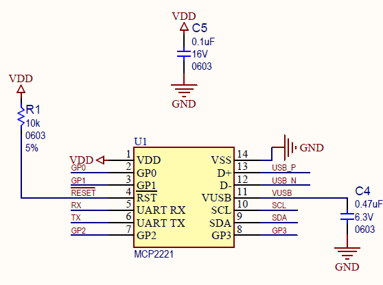

=====================================================
PyMCP2221A
=====================================================

- What is.

This is a Microchip MCP2221(A) HID Library in python.

これはMCP2221(A)のHIDを使ったPythonライブラリーです。

MCP2221 & MCP2221A work in Python. 

MCP2221 と MCP2221A で動作します。

- Install

This library uses hitapi.

    - pip install hidapi

    - https://github.com/trezor/cython-hidapi

PyMCP2221A Install

    - pip install PyMCP2221A

- Sample

import PyMCP2221A

mcp2221 = PyMCP2221A.PyMCP2221A()

- Setup

- Example

    - MCP2221 ADC : OK :

    - MCP2221 DAC : OK :
    
    - MCP2221 GPIO : OK :
    
    - MCP2221 Interrupt : No :
    
    - MCP2221 Clock : OK :
    
    - MCP2221 I2C  : OK :

- License

    The MIT License (MIT) Copyright (c) 2017 Yuta KItagami (kitagami@artifactnoise.com,@nonnoise)
